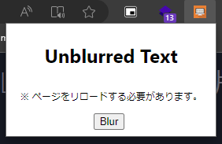
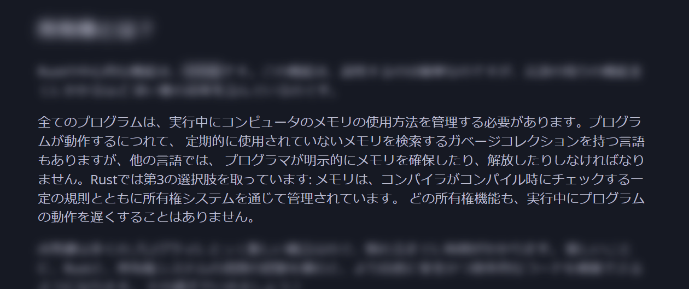

# Blur Focus

## Description
Chrome拡張機能。有効にしている間、ホバーしているテキスト以外をぼかします。
私自身、ドキュメントを読んでいると文字が滑ってしまい集中できないことがあるため、この拡張機能を作成しました。

## Usage
Search: [chrome://extensions/](chrome://extensions/) or [edge://extensions/](edge://extensions/) (Chromium製ブラウザであれば動作します。)
1. 開発者モードを有効にする
2. `パッケージ化されていない拡張機能を読み込む` をクリック
3. `blur-focus/dist` フォルダを選択

## Known issues
- 動的に生成される要素には対応していません。
- タグが指定されていない要素には対応していません。

## Demo Picture

Page URL: [https://doc.rust-jp.rs/book-ja/ch04-01-what-is-ownership.html](https://doc.rust-jp.rs/book-ja/ch04-01-what-is-ownership.html)